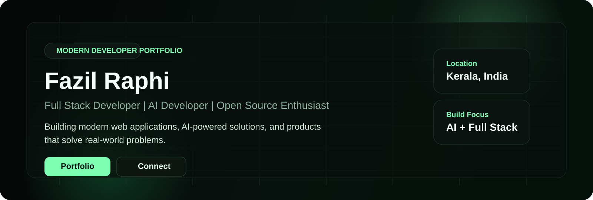
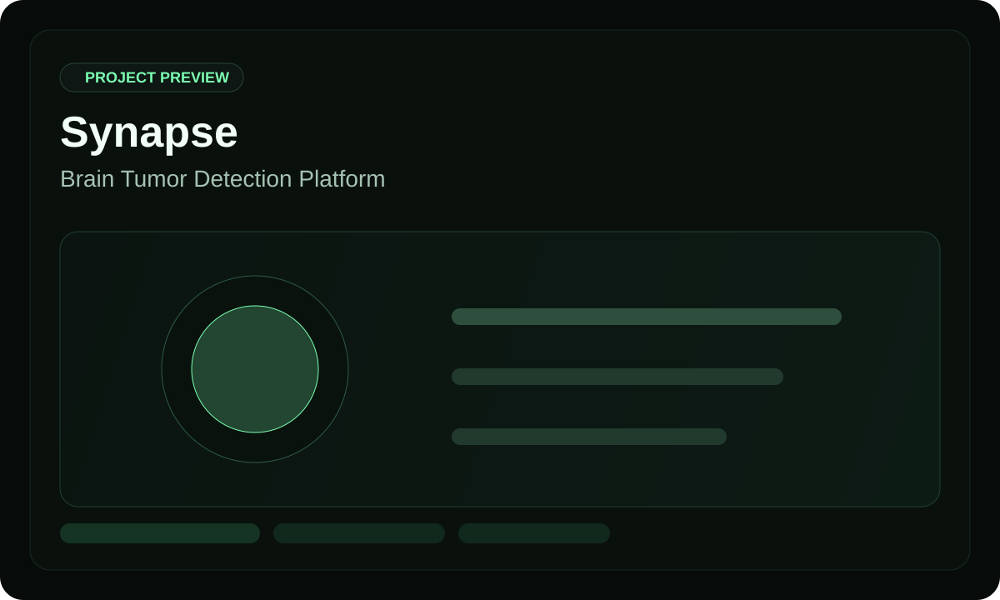
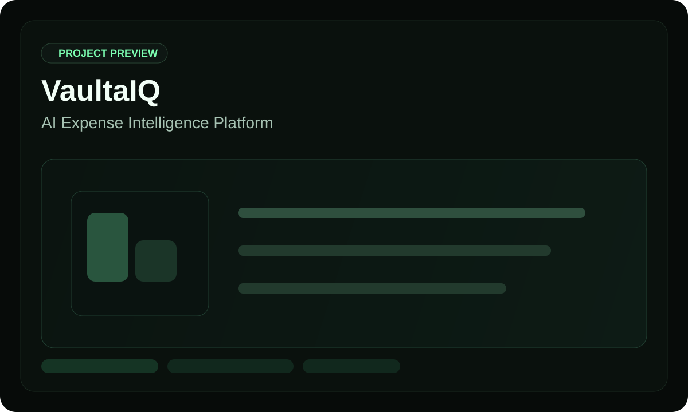

# 
Fazil Raphi

  

  
  
  
  

  Full Stack Developer | AI Developer | Open Source Enthusiast | Kerala, India

 

## Overview

<table>
  <tr>
    <td width="62%" valign="top">
      <h3>About Me</h3>
      

        I'm Fazil Raphi, a developer focused on building modern web applications, AI-powered tools, and products that solve real-world problems.
      

      

        My journey has been shaped by curiosity across full stack engineering, intelligent systems, clean product experiences, and the kind of software that feels useful from day one.
      

      

        I enjoy turning ideas into practical products, refining developer experience, and exploring how AI can be woven into everyday workflows without making the product feel heavy.
      

    </td>
    <td width="38%" valign="top">
      <h3>Quick Snapshot</h3>
      
<strong>Focus</strong> Modern apps, AI workflows, product engineering

      
<strong>Works With</strong> React, Next.js, FastAPI, ML

      
<strong>Build Style</strong> Minimal, fast, useful, and production-minded

      
<strong>Open To</strong> Collaboration, open source, thoughtful product work

    </td>
  </tr>
</table>

## Building, Learning & Experimenting

<table>
  <tr>
    <td width="33%" valign="top">
      <h4>Building</h4>
      
Working on new products that combine solid frontend UX with practical backend systems and AI-assisted flows.

    </td>
    <td width="33%" valign="top">
      <h4>Learning</h4>
      
Exploring AI applications, cloud technologies, and system design with a strong bias toward real implementation.

    </td>
    <td width="34%" valign="top">
      <h4>Experimenting</h4>
      
Contributing to open source, testing product ideas, and improving the small details that make software feel sharp.

    </td>
  </tr>
</table>

## Featured Projects

<table>
  <tr>
    <td width="50%" valign="top">
      
      <h3>Synapse</h3>
      
<strong>Brain Tumor Detection Platform</strong>

      
AI-powered brain tumor detection and classification platform with a modern user experience.

      

        <strong>Stack</strong> 
        React | FastAPI | TensorFlow | Firebase
      

      

        <a href="https://synapse-frontend-amber.vercel.app/">Live Product</a> |
        <a href="https://github.com/FazilPRaphi/synapse">GitHub Repo</a>
      

    </td>
    <td width="50%" valign="top">
      
      <h3>VaultaIQ</h3>
      
<strong>AI Expense Intelligence Platform</strong>

      
AI-powered personal finance and expense intelligence platform built for clearer money decisions.

      

        <strong>Stack</strong> 
        Next.js | Supabase | PostgreSQL | OpenAI
      

      

        <a href="https://vaultaiq-git-main-fazil-rafis-projects.vercel.app/login">Live Product</a> |
        <a href="https://github.com/FazilPRaphi/vaultaiq">GitHub Repo</a>
      

    </td>
  </tr>
</table>

## Communities & Memberships

<table>
  <tr>
    <td width="50%" valign="top">
      <h3>Firebase Studio Developer Community</h3>
      
Member

      
Part of a community centered around product building, Firebase workflows, and developer collaboration.

    </td>
    <td width="50%" valign="top">
      <h3>Google Developer Groups</h3>
      
Member

      
Connected with a wider developer ecosystem through events, community knowledge-sharing, and applied learning.

    </td>
  </tr>
</table>

## Communities & Memberships

<table>
  <tr>
    <td width="50%" valign="top">
      <h3>Firebase Studio Developer Community</h3>
      
Member

      
Part of a community centered around product building, Firebase workflows, and developer collaboration.

    </td>
    <td width="50%" valign="top">
      <h3>Google Developer Groups</h3>
      
Member

      
Connected with a wider developer ecosystem through events, community knowledge-sharing, and applied learning.

    </td>
  </tr>
</table>

## Tech Stack

<table>
  <tr>
    <td width="50%" valign="top">
      <h4>Frontend</h4>
      

        
      

      <h4>Backend</h4>
      

        
      

      <h4>Databases</h4>
      

        
      

    </td>
    <td width="50%" valign="top">
      <h4>AI / ML</h4>
      

        
      

      <h4>Cloud & DevOps</h4>
      

        
      

      <h4>Design</h4>
      

        
      

    </td>
  </tr>
</table>

## GitHub Analytics

<!-- GitHub analytics wired for FazilPRaphi -->

<table>
  <tr>
    <td width="50%">
      
    </td>
    <td width="50%">
      
    </td>
  </tr>
  <tr>
    <td colspan="2" align="center">
      
    </td>
  </tr>
</table>

## Beyond Code

<table>
  <tr>
    <td width="50%" valign="top">
      
Football: Bayern Munich supporter

      
Germany: Interested in engineering, innovation, and technology

    </td>
    <td width="50%" valign="top">
      
Music: My favorite coding companion

      
Mindset: Always exploring new technologies

    </td>
  </tr>
</table>

## Connect

  
  
  
  

 

